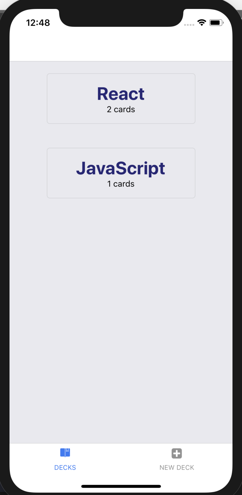
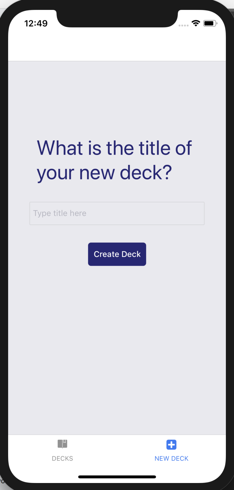
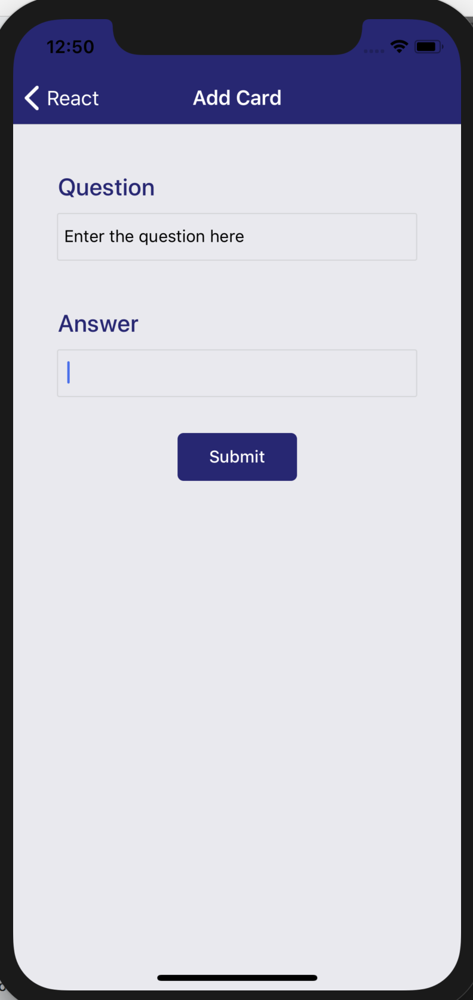
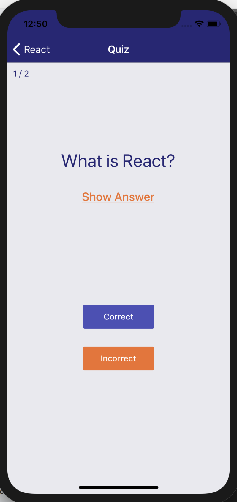
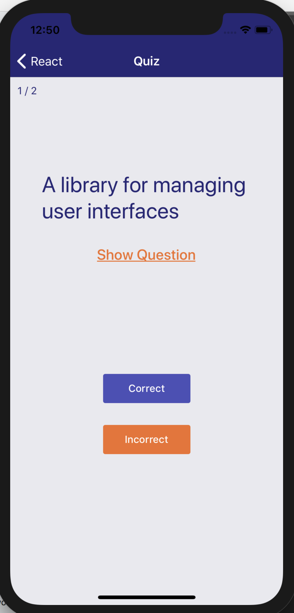

## An React Native/Redux App will allow you to set up your flashcards and keep learning everyday

### How to install
In your Terminal(mac)/Command Line(Windows), enter the commands below

```
$ git clone https://github.com/amazeIvy/react-native-flashcards.git

$ cd react-native-flashcards

$ yarn install

$ yarn start OR $ expo start
```

### How to run
You need an simulator or a mobile device to run this app. The easiest way is to install Expo App on your mobile device then link to the app

[Expo on App Store](https://itunes.apple.com/us/app/expo-client/id982107779) - iOS

[Expo on Google Play](https://play.google.com/store/apps/details?id=host.exp.exponent) - android

### How the app looks like
- Decks (Initial view of the app)



Will show 2 default Decks

- New Deck


- New Card


- Start a quiz



- Show the score


### Dev Tests
I have tested all functions through iOS simulator and my iPhone 7. Everything is working fine.
I also tested on android simulator, unfortunately the *Resart Quiz* button below score when finishing a quiz won't working
